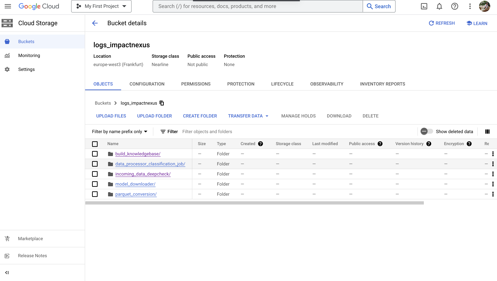
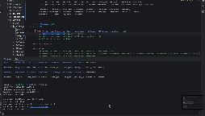

## Getting Started:

Installation:
    
    make install-dev (for development)

    make install-prod (for production)

    make download-data (download data from internet sources)

    make install-gcp
    (install google cloud services)


Sync models between GCP and local:
   
    make sync models-local
    make sync models-gcp

Run:
     
    make run
spin off the django server.
    (core to all services provided with different to previous codebase with multiple projects)

    make run-docker
(run all core services on docker)
    
    make run-docker-gpu

(run all core services on docker with gpu)


Precommit:

    make install-precommit
Installs precommit.

    make run-precommit
runs precommit.


## Changes Made: Why?
   
  1. The project given was more experimental and not ready for production.
Below find the diagram from the overall pipeline implementation, with highlights 
on how parts of the project were proposed to be readapted and how I propose to unify
the entire solution into services.

  2. Designed a Service Based Architecture: django + ninja api backend. why? Fast API is good and easily adaptable to
     django. Django has better integrations like FSM (finite state machine if needed in future.) + more library components

  
 3. Previous Project had pipeline which was from different projects: Spacy, HeyStack and fastapi
    
    For production one should not use Spacy: Spacy provides language models but there are good alternatives: like NLTK with
    stemming and lemmatization. OpenAI Ada is currently the best embedding with 1279 Vector sofar surpassing Gloves, BERT, WORD2Vec
    etc..

    For pipeline use:
    
    
    CI/CD of github workflow + Data Version Control (DVC) (Data as code and git) + CML + Deep Checks ML functionality
            testing + WANDB to visualize the results.
    
    
I adopt an API first development approach: 
    
    Data Scientis tests on google colab or jupyter notebook --> 
    Ninja API makes it easy to add endpoints. -->
    Same server on django are used by developers, data scientists
    and data stakeholders. Its just different endpoints.   -->
    Use DVC service to efficiently test parts of pipeline modularly.

   Below find the diagram of the overall pipeline


   
The pipeline consists of the Services. Services cater for manual processes for different stakeholders within a company:

1.Django service provides endpoints for:
        
    
    A: Data Optimisation (from .xlsx,csv,.tsv,.pdf, etc... to unified format conversion to parquet) 
       Services/services_app/api/routers/parquet_conversion.py
        
        
    B: Builds knowledgebase (takes data from master knowledge folder to produce a jsonl knowledge base with source folder and subfolders as metadata and 
       This in turn can be later used with neojs for data visualisation. 
       Services/services_app/api/routers/build_knowledgebase.py
        
    C: Incoming Data Check.
        a suite of tests thats test the incoming, gets its embeddings (can be later used to semantically cluster and check for Data or label
        drifts).


It consists of Services with the following directories. In General it's a django project.

```
    Services
    │   DVC
    │   Airbyte (should be a different repo: airbyte github clone) 
    │   services_app
    │   │   api
    │   │   │   
    │   │   └─── routers
    │   │   └─── build_knowledgebase.py
    │   │   │    └─── data_processor_classification_job.py
    │   │   │    └─── incoming_data_deepcheck.py
    │   │   │    └─── model_downloader.py
    │   │   │    └─── parquet_conversion.py
    │   │   └─── schemas
    │   │        └─── annotationOUT.py
    │   │        └─── DataOUT.py
    │   │        └─── ImpactScreeningOUT.py
    │   │        └─── rest_api_schema.py
    │   services_project
    │   │   
    │   wandb  (service to get the visualisation on the quality of the incoming data)
    │   haystack_core_components
    │   JOBS
    │   KnowledgeBase
    │   KnowledgeBaseParquet
    │   logs
   ```   
    
   The improvements I proposed are based on 
   * Python Programming style
   * Data Costs and Scalability
   * Data Download, Data Ingestion and Data Aggregration
   * Incoming Data Quality Check, Data Drift 
   * MLOPs, Data Versioning, Continuous Machine Learning (CML), CI/CD ML Suite Test
    
   In each case I reported why and how.

## Services in Action:
    
1. The previous pipeline misses a lot on data quality check, data-imbalancement, data drifts, labels-drift.

    Endpoint: Services/services_app/api/routers/incoming_data_deepcheck.py


    
    This service can be hosted on any cloud service with GPU and embeddings on new stream of data calculated
    such that data is analysed to find anmomaly before being used to train new models or current ones.
   
    This service integrates WANDB (https://wandb.ai/site) and each session is logged and can be extended to save
    as experiment on the cloud. 

    For every job type: a different transformation is required and found under:
    Target: Services/services_app/JOBS/Classification/target/ 
    Source: Services/services_app/JOBS/Classification/source/

    Only 2 JOBS are required: entity recognition (similar to classification) and emotional classification (special form
    of classification). 

    Spacy should not be used. Levenstein method like you are using is good if characters are misspelled but the core
    algorithm should focus on differentiation by semantics (use semantic embeddings like OpenAI ADA model or hugging face
    language models).


2. Knowledgebase Service:
    Endpoint: Services/services_app/api/routers/build_knowledgebase
    Input: <Path to Knowledgebase>
    Output: <JSONL of the entire database as knowledgebase>
   
    I complment the idea of using NeoJS. Its a good decision.
    
3. Data Optimisation


    Endpoint: Services/services_app/api/routers/parquet_conversion_service
    
       Input: <Path to Local Folder containing Knowledgebase>
       Output: <optimised KnowledgeBaseParquet> 
    
       Its a service that can be easily deployed and added to data optimisation pipeline. (see cost and advantages below: Data Costs and Scalability)


4.  Classification JOB Transformation Service
    Endpoint: Services/services_app/routers/process_file.py
    
    Input: <Path to file corresponding to job>
    Ouput: <Processed file ready for semantic analysis Job> 
    
    This endpoint is really dynamic: it take any file .csv or best optimised parquet and since emotional/sentiment
    analysis can be a multivariate problem: user can select the input from the table and output label is added along
    with train_test split. The other columns are treated as metadata and can be used to further enhance classification.
    
    This is JOB Transformation service.
    The NLP Jobs required in this project are classification and language modelling. 
   
    The raw Data can be synced with Google Bucket live and the transformed Data in a different bucket. The data transformation
    is dependent on the JOB here defined under: "Services/services_app/JOBS/Classification/source"


    Under "Services/services_app/JOBS/LanguageModelling" all the functions that compute co-coccurence matrix or simply
    any bayesian method primitive language model can be written and served under one endpoint. The language model
    is then saved under: Google Bucket or any S3 or Athena. My Buckets are under:

    gs://jobs_impactnexus


## Python Programming Style 
   Pre-conmmits containing blake, isort, github CI/CD with Continuous Machine Learning

## Data Costs and Scalabitliy: 
   Data comes in different formats: pdf,csv,tsv,xslx,json,jsonl, etc..
   I propose to convert them to apache parquet both for faster data transfer and data readability purposes leading
   to massive cost savings as data becomes enormous.
    
In perspective:


## Data Download && Data Ingestion && Data Aggregation
   
   1. The Django Service has an endpoint to download data for example from "Oekobaudat Service". As a company you can  spend time
   developing endpoints and curating data or use Airbyte (like i showed in the diagram at the beginning) to build robust Data Connectors.
   This will save development time. Airbyte can also be used to  build Airtable or any third party service api quickly and robust.

## Data Visualisation Tool
   1. WANDB + Deep Checks.
     https://wandb.ai/concular/deepchecks?workspace=user-oushesh
     https://deepchecks.com/

    Below see endpoint (Services/services_app/routers/deepcheck) proviing insights 
    on a processed data for a classification job.

    Raw Data: Services/services_app/JOBS/Classification/source
    Processed Data: Services/services_app/JOBS/target/..*.csv
    (the endpoint used for this: Services/services_app/api/routers/data_processor_classification_job.py)


Those 2 tools provide a framework to build a test suite and get embeddings from incoming data to visualize
properties such as label and data drift and other checks for data.  

Pipeline can be extended to accommodate more test suites with the Framework of DeepChecks.
Raw Data is transformed to task specific job. 

Pipeline Example here:


    This endpoint can be served as a lambda function on AWS or any online platform. It
    would sync upon new incoming data and perform the transformation for the job as 
    well as run the Embeddings to check for Data Drift, label drift, new words, percentage of 
    new characters thus check if new Data domain is shifted too much even before training starts.
    It promotes better decision making and transparency after models have been pushed to production.
    (understand decision making).
  
   2. The old pipeline does not account for any service to get semantcs of incoming data: 
      I propose passing the entire database to a
     vector database like Qdrant or Pinecone or Weaviate with OpenAI Ada Embeddings to get a semantic 
     graph of the data
     API to classify data.

## Data Retraining and Versioning.
   Data Version Control (DVC) and check the next part of the instruction
 
## ML OPS && CML (Continuous Machine Learning) 
   
   The previous pipeline dit not account for the OPS and Continuous Machine Learning. CML + DVC 
   is one of the best framework to achieve this. DVC treats data and models like Git files with hash. 
   Upon retesting an old pipeline: even only pipelines that have been changed, only scripts
   that were changed or models whether local or online that were changed will be used for testing.


   Using DVC and CML allows multiple people to work in different branches simultaneously on the same part 
   of the pipeline or different parts of the pipeline and push code. The .yaml is written such that only
   changes in the specific folder corresponding to the tests gets triggered saving time and being more efficient.

   * Github actions (.github/workflows/<test.yaml>) + Data Version Control  

   1. Data Version Control: "Git for Data"
   dvc get 
   2. downloads any data from a url pointing to s3, google bucket
            or other cloud services and saves where you want.
            It uses hash map like git to efficiently track and cash changes.

    Services/DVC contains the different workflows
    Example of Data Versioning:
    
    dvc get gs://dvc_models_bucket/models.pkl -o Services/DVC/models/models.pkl
    
    Track: dvc add Services/DVC/models/models.pkl
    Any changes people working with you did either on the bucket or new model
    it gets pushed and tested with the yaml. The test gets trrigered and pipeline is evaluated.

    Example: Services/DVC/test 
    A. Train script model was changed from LinearRegression to Lasso Model.
    B. The change triggers the test written under .github/workflows/test.yaml
    C. dvc can also be use to track the model with the bucket in google cloud: gs://dvc_models_bucket/models/
    

2. DVC can compress GBs of data in bytes of metadata where the data sits on the cloud: s3, GCP. gdrive 
   or anything else.

3.  


Every github workflows corresponds to the bucket names on google bucket or any other service.


    
    Every DVC Experiment is:
    ```
    Services/DVC/<Name of Workflow or pipeline> 
    │   model/
    │   data/    
    │   test.py
    │   train.py
    │   other_scripts.py
    │   requirements.txt
    ```

4. Data Pipelines: (dubbed as Makefile for ML Projects along with CML(Continuous Machine Learning))
     Usually pipelines are connected with different steps in different.py files.

      Changing anything in the train or any other script will only trigger that script. When your pipeline gets huge
      and uses GPU for training. Only the changes in script will run the results of the users that did not change
      will be retrieved and only the specific script with changes will run.


    3. ML OPS and Robustness:

    Perturbation test is used to test robustness of a given pipeline. The inputs are perturbed
    and the model from hugging face like most of the models used at Impact Nexus are used.
    This was missing in the old pipeline. The pipeline  
   


    
    Other tests are mentionned in the department of Data and Label Drift as well as Embeddings Drift

   
  3. Workflows Requiring GPUs:

   Heavy Training requiring GPUs cannot be run on github directly. Instead spin off GPU service and attach the worker. 
   Or: use local GPU. (PS: I dont have on my mac m2 pro.)
   
   A. 
        
        GPU nvidia-docker cml aws ec2 deep learning AMI
        Choose aws ec2 deep learning AMI Ubuntu 18.04
        ssh into your ec2 instance from that terminal you can work into 
        your pycharm or terminal.

   B.    
        
        run nvidia-smi
        Check all the gpus in the docker
        docker run --gpus all dvcorg/cml-py3 nvidia-smi
       
        This will check if cml image of nvidia-smi is available otherwise
        it will pull it.
        
        You should see your gpu on terminal
   
   C. 
        
        Next step is to connect GH (github-actions) with docker. (I personally
        dont have GPU on my mac M2)

        Reference: https://www.jeremyjordan.me/testing-ml/
    
       docker run --name gpurunner -d --gpus all -e RUNNER_IDLE_TIMEOUT=1000 -e RUNNER_LABELS=cml,gpu -e RUNNER_REPO="url_to_your_github_repository" -e repo_token="your_personal_access_token"
    
       This gpu docker cml can run in the background. This will be a self-hosted runner running on your ec2 instance or gcp.

       The CML docker container will listen to the workflows from github or gitlab.
        
        You can autoscale the workflows on self-hosted gpu machines for lots of developers
        if they exist: https://docs.github.com/en/webhooks/webhook-events-and-payloads#workflow_job

## Data Version Control (DVC) 
    Services/DVC
    
    One of the most powerful updates to the previous pipeline I provide is the use of dvc which as shown in the gif
    has the power to exectute only those steps of the code which are changed. As the pipeine grows more and more complex
    only parts that are changed are retrained leading to faster and safer development.
    * Data Version Control retraining without chaning all parts of the pipeline.

    You can also visualize the Directy Acycli Graph of the pipline using
    dvc dag

    While there are other options like Apache Airflow, DVC and CML is preferred since it provides:
    Versioning of Data, Continuous ML, CI/CD

Below you see when the parameter in the script of the pipeline is changed. The tests are rerun.


    

## Tests: 

    make test
   
   All tests written with pytest, pytest.fixtures. The tests can be extended to all endpoints and pass.
   Logic tests can be written like the ones shown here. But also, integration test as well as data injection
   test.
    
   Below you see the test for the parquet conversion service endpoint 
   under Services/api/routers/parquet_conversion functionality.

   All the endpoints will have a different test script here under the folder tests
   triggered by the make file. This allows for quick testing using just make test
   command.


    More tests can be added using this structure.

   

   The tests are written with pytest.ini and every endpoint can tested as such. The tests written in the old repo can 
   be easily adapted. 


## Logging System: 
   The entire logging system is based on python module logging and the logs are synced on the cloud on supabase.
   Each endpoint should have a logging system recording. 

   The system has better debuggability with different levels of logging ranging from:
   * info
   * error
   * warning
   * critical warning

   The logs have timestamps and chronologically in order for reference.

   When the project becomes really large as extension I propose to change
   the naming of the file and add <_underscore_date_and_time> as well as uploading to
   postgresql or supabase on gloud service. SQL are fast to query and read.
    
   For further development: I would design a cron job which would periodically sync
   all the log files on the cloud (gcp) and delete old ones (local.) I dont prefer
   a direct writing on the cloud since it will hinder speed of execution of the 
   process in general. 
   Now the logs are as .logs and synced with local at:
    
    gs://logs_impactnexus




## Airbyte: 
  
   1. Why airbyte and no standard development of endpoint if only data connectors are needed? 
   Well for building endpoints that connect a source data source to another destination 
   (example Google query or aws s3 to postgres sql). 

   Engineers save lots of time avoid repetitive tasks like Schema definition, pagination,
   payload, auth, etc..

   Example of oekobautdat (a really important dataset for ESG metrics) set data downloader
   as shown by Airbyte Connector.
   
   2. The second big advantage of Airbyte is that it has built-in Data built-tools (DBT) which
      is a fantastic innovation treating data (sql or table data) as modular components and reused.

    (Check my first diagram on the services)


## Haystack 
   1. Personally I welcome the idea of using Haystack. As I am consulting
   various companies using LLM these days 

   2. I don't see any technical debt coming in the future with Haystack.
      A: It integrates well with the best new Vector Databases 
          such as: Weaviate, Qdrant, Pinecone.
      B:  LLM forms a big part in NLP and in the near future it will brought to
          Impact Nexus as well.
      
      C:  Haystack is good for building RAG and Semantic Vector retrieval pipeline.
      D:  Custom Components can be added easily. Haystack_core_components (Services/services_app/haystack_core_components)
          contains pipeline builder and other classes to abstract DocumentStore. Using those components I show how pipeline
          can be easily tested as endpoints. I focus on modular code easily moving from prototype to endpoints under services.
          For production one should move away from InMemory.  (InMemoryDocumentStore()) --> instead use ElasticSearch or any cloud service.

   3. Since the Pipeline development in Haystack is focussed on nodes (similar to tensorflow or keras code flow): 
      it's easy to write each one in a different script and build a DAG (Direct Acyclic Graph) in DVC and CML. (see above)
      Pipeline is easily tested using Data Version Control.

      All endpoints have data synced on Google Cloud as well as their logs.
   
   4. NLP 



  # TODO : For haystack LLM pipeline: https://haystack.deepset.ai/tutorials/02_finetune_a_model_on_your_data
    TODO: https://haystack.deepset.ai/tutorials/11_pipelines
    TODO: https://haystack.deepset.ai/tutorials/02_finetune_a_model_on_your_data
    TODO: This should make me win the interview.

## Summary:
   1. My pipeline uses Django as service which integrates all the needed tools for decision making. 
      FastAPI is good but lacks good libraries like Finite State Machine if needed among others.
   by the Domain Expert people (people knowing how to calculate LCA, ESG etc..). It gives them
   tool to visuallise data.

   2. My tool proposes Data optimisation from multiple formats from multiple sources to Apache Parquet Format
      to save labour and computer cost
   3. My tool integrates Airbyte thus saving development on data connectors and avoid writing endpoints to transform
      data from already established 3rd parties like Airtable, s3, athena or posgresql.
   4. My tools integrates Data Quality Check and Drifts using DeepCheck and more task specific tools can be added easily
      and called to the endpoint. Every session is automatically saved on WANDB (https://wandb.ai/) and dynamic plots accessed
   5. My tools integrates DeepCheck and its data transformation (specific for task: like Emotion/Tag Classification)
   6. makefile to ease running commands around like testing and server running
   7. Provides a comprehensive on how to do fast Development from jupyternotebooks to directly test pipeline changes using DVC and CML and build new endpoints
      to test new services which are already robust.
   8. Owing to use of DVC I can easily test big time consuming pipelines where only changes in 1 script  are rerun
      after "dvc repro". I provide a vision for Data Versioning, Model Versioning  as well as Model Registry
      (DVC integrates online services where models are saved: here gcp). 
   9. I provided a very modular code development process where most of the components from haystack that you used
      under rest_api_dev and other pipelines can be extended under: Services/haystack_core_components which then 
      can be imported into new endpoints under: Services/api/routers and schema under Services/api/sehema.
        
       Most of services from here can be imported as endpoints i have developed.
       
     `download-pipeline` 
    `download-insight-classifier`
    `download-boolqa-concept-relation-classifier` 
    `create-documents` 
    `upload-corpus` | Upload all corpus |
    `download-corpus` | Download all corpus |
    `download-test-corpus` | Download test corpus |
    `package-and-install-entity-pipeline-cpu` | Create spacy package for en_ix_entity_ruler pipeline |
    `package-and-install-entity-pipeline` | Create spacy package for en_ix_entity_ruler pipeline |
    `upload-package-entity-pipeline` |  |
    `extract-documents` | Extract document from scrape index. |
    `extract-insights` | Extract document elements, e.g. paragraphs, abstract from documents. |
    `annotate-insights` | Annotate insights |
    `generate-annotation-tasks` | Annotate insights |
    `serve-dev` |  

   10. Spacy is completed banned. For validating a service that is ready for production just add an 
       endpoint as "/serve/..." in Django then test inference live. 
   11. I have radically changed the philosophy of the project but maintained integrity of the 
       the components used like Haystack. Code is modular and components can be reused. I support haystack. The project now integrates WANDB, DeepCheck, Data Verion
       Control (DVC) + CML, GCP or any other service and airbyte and caters for different people
       within the team trying to avoid manual tasks. 
   12. I added a sample perturbation_test using DVC, to accommodate for future robustness of models when data is corrupted.

    .github/workflows/perturbation_test.yaml 


## Further Development: 
   * Terraform for multiple application deployment and application life cycle. 
   * Cron jobs to sync data daily multiple times and extend our pipeline for data check. I would personally avoid real time incoming data check.
   * add a deploy.sh and a new .github/workflows to deploy new endpoints automatically should tests have been passed and new models trained.
     (Combine DVC,CML with deploy.sh bash file)

## Resources:
    https://iterative.ai/blog/cml-self-hosted-runners-on-demand-with-gpus
    (how to self-host runners on gpus)
  


