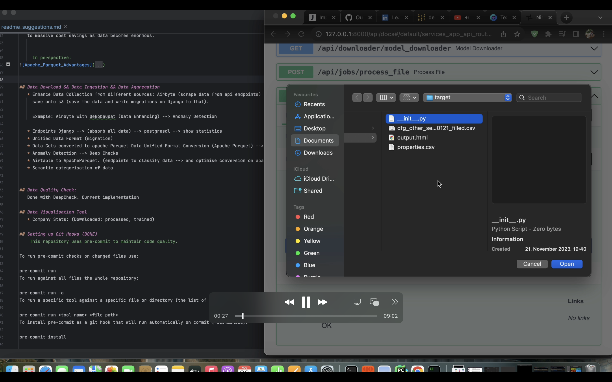
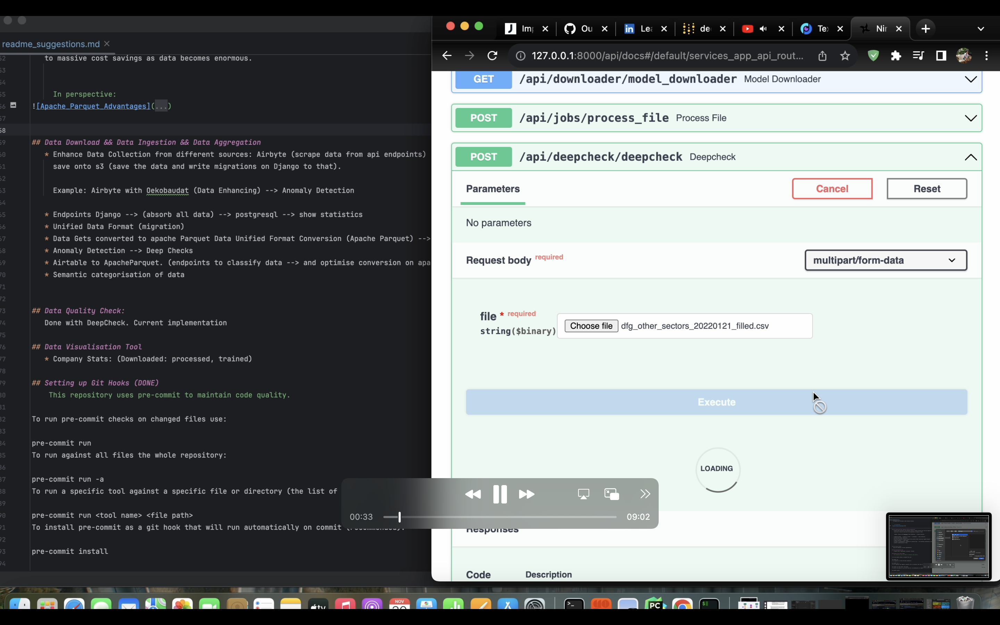
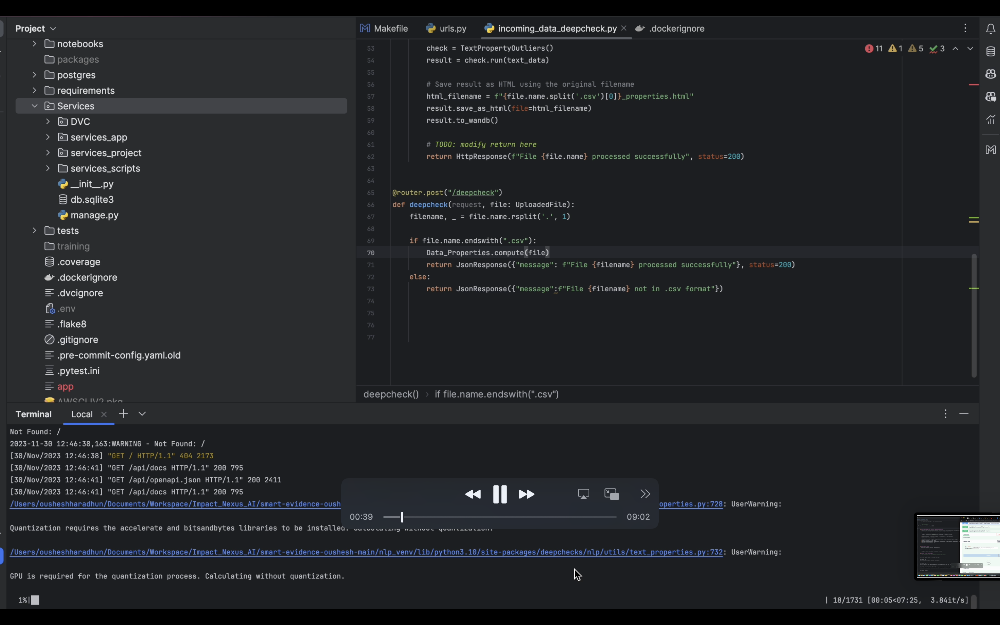
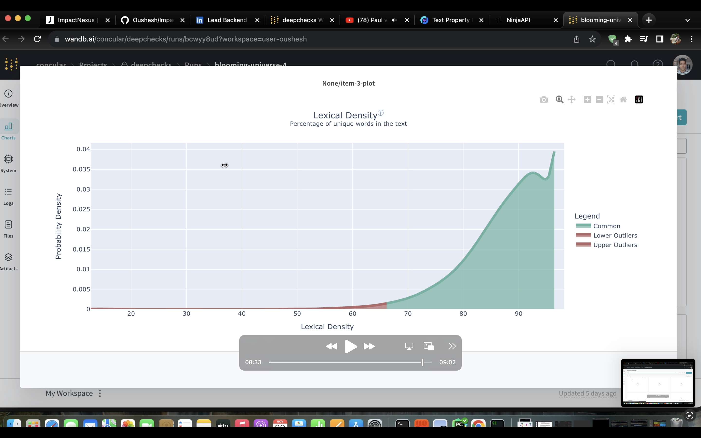
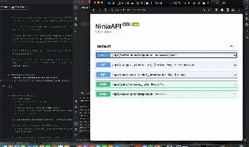

## Getting Started:

Installation:
    
    make install-dev (for development)

    make install-prod (for production)

    make download-data (download data from internet sources)

    make install-gcp
    (install google cloud services)


Sync models between GCP and local:
   
    make sync models-local
    make sync models-gcp

Run:
     
    make run
spin off the django server.
    (core to all services provided with different to previous codebase with multiple projects)

    make run-docker
(run all core services on docker)
    
    make run-docker-gpu

(run all core services on docker with gpu)


Precommit:

    make install-precommit
Installs precommit.

    make run-precommit
runs precommit.


## Changes Made: Why?
   
  1. The project given was more experimental and not ready for production.
Below find the diagram from the overall pipeline implementation, with highlights 
on how parts of the project were proposed to be readapted and how I propose to unify
the entire solution into services.

  2. Designed a Service Based Architecture: django + ninja api backend. why? Fast API is good and easily adaptable to
     django. Django has better integrations like FSM (finite state machine if needed in future.) + more library components

  
 3. Previous Project had pipeline which was from different projects: Spacy, HeyStack and fastapi
    
    For production one should not use Spacy: Spacy provides language models but there are good alternatives: like NLTK with
    stemming and lemmatization. OpenAI Ada is currently the best embedding with 1279 Vector sofar surpassing Gloves, BERT, WORD2Vec
    etc..

    For pipeline use:
    
    
    CI/CD of github workflow + Data Version Control (DVC) (Data as code and git) + CML + Deep Checks ML functionality
            testing + WANDB to visualize the results.
    
    
I adopt an API first development approach: 
    
    Data Scientis tests on google colab or jupyter notebook --> 
    Ninja API makes it easy to add endpoints. -->
    Same server on django are used by developers, data scientists
    and data stakeholders. Its just different endpoints.   -->
    Use DVC service to efficiently test parts of pipeline modularly.

   Below find the diagram of the overall pipeline


   
The pipeline consists of the Services. Services cater for manual processes for different stakeholders within a company:

1.Django service provides endpoints for:
        
    
    A: Data Optimisation (from .xlsx,csv,.tsv,.pdf, etc... to unified format conversion to parquet) 
       Services/services_app/api/routers/parquet_conversion.py
        
        
    B: Builds knowledgebase (takes data from master knowledge folder to produce a jsonl knowledge base with source folder and subfolders as metadata and 
       This in turn can be later used with neojs for data visualisation. 
       Services/services_app/api/routers/build_knowledgebase.py
        
    C: Incoming Data Check.
        a suite of tests thats test the incoming, gets its embeddings (can be later used to semantically cluster and check for Data or label
        drifts).


It consists of Services with the following directories. In General it's a django project.

```
    Services
    │   Airbyte (should be a different repo: airbyte github clone) 
    │   services_app
    │   │   api
    │   │   │   
    │   │   └─── routers
    │   │   └─── build_knowledgebase.py
    │   │   │    └─── data_processor_classification_job.py
    │   │   │    └─── incoming_data_deepcheck.py
    │   │   │    └─── model_downloader.py
    │   │   │    └─── parquet_conversion.py
    │   │   └─── schemas
    │   │        └─── annotationOUT.py
    │   │        └─── DataOUT.py
    │   │        └─── ImpactScreeningOUT.py
    │   │        └─── rest_api_schema.py
    │   services_project
    │   │   
    │   wandb  (service to get the visualisation on the quality of the incoming data)
   ```   
    
   The improvements I proposed are based on 
   * Python Programming style
   * Data Costs and Scalability
   * Data Download, Data Ingestion and Data Aggregration
   * Incoming Data Quality Check, Data Drift 
   * MLOPs, Data Versioning, Continuous Machine Learning (CML), CI/CD ML Suite Test
    
   In each case I reported why and how.

## Services in Action:
    
1. The previous pipeline misses a lot on data quality check, data-imbalancement, data drifts, labels-drift.

    Endpoint: Services/services_app/api/routers/incoming_data_deepcheck.py
    
     








    
    This service can be hosted on any cloud service with GPU and embeddings on new stream of data calculated
    such that data is analysed to find anmomaly before being used to train new models or current ones.
   
    This service integrates WANDB (https://wandb.ai/site) and each session is logged and can be extended to save
    as experiment on the cloud. 

    For every job type: a different transformation is required and found under:
    Target: Services/services_app/JOBS/Classification/target/ 
    Source: Services/services_app/JOBS/Classification/source/

    Only 2 JOBS are required: entity recognition (similar to classification) and emotional classification (special form
    of classification). 

    Spacy should not be used. Levenstein method like you are using is good if characters are misspelled but the core
    algorithm should focus on differentiation by semantics (use semantic embeddings like OpenAI ADA model or hugging face
    language models).


2. Knowledgebase Service:
    Endpoint: Services/services_app/api/routers/build_knowledgebase
    Input: <Path to Knowledgebase>
    Output: <JSONL of the entire database as knowledgebase>
   
    I complment the idea of using NeoJS. Its a good decision.
    
3. Data Optimisation


    Endpoint: Services/services_app/api/routers/parquet_conversion_service
    
       Input: <Path to Local Folder containing Knowledgebase>
       Output: <optimised KnowledgeBaseParquet> 
    
       Its a service that can be easily deployed and added to data optimisation pipeline. (see cost and advantages below: Data Costs and Scalability)




4.  Classification JOB Transformation Service
    Endpoint: Services/services_app/routers/process_file.py
    
    Input: <Path to file corresponding to job>
    Ouput: <Processed file ready for semantic analysis Job> 
    
    This endpoint is really dynamic: it take any file .csv or best optimised parquet and since emotional/sentiment
    analysis can be a multivariate problem: user can select the input from the table and output label is added along
    with train_test split. The other columns are treated as metadata and can be used to further enhance classification.
    
    This is JOB Transformation service.
    The NLP Jobs required in this project are classification and language modelling. 
   
    The raw Data can be synced with Google Bucket live and the transformed Data in a different bucket. The data transformation
    is dependent on the JOB here defined under: "Services/services_app/JOBS/Classification/source"


    Under "Services/services_app/JOBS/LanguageModelling" all the functions that compute co-coccurence matrix or simply
    any bayesian method primitive language model can be written and served under one endpoint. The language model
    is then saved under: Google Bucket or any S3 or Athena. My Buckets are under:

    gs://jobs_impactnexus


## Python Programming Style 
   Pre-conmmits containing blake, isort, github CI/CD with Continuous Machine Learning

## Data Costs and Scalabitliy: 
   Data comes in different formats: pdf,csv,tsv,xslx,json,jsonl, etc..
   I propose to convert them to apache parquet both for faster data transfer and data readability purposes leading
   to massive cost savings as data becomes enormous.
    
In perspective:


## Data Download && Data Ingestion && Data Aggregation
   
   1. The Django Service has an endpoint to download data for example from "Oekobaudat Service". As a company you can  spend time
   developing endpoints and curating data or use Airbyte (like i showed in the diagram at the beginning) to build robust Data Connectors.
   This will save development time. Airbyte can also be used to  build Airtable or any third party service api quickly and robust.

## Data Visualisation Tool
   * WANDB. I propose passing the entire database to a vector database like Qdrant or Pinecone or Weaviate with OpenAI Ada Embeddings
     API to classify data.

## Data Retraining and Versioning.
   * add an endpoint for absorbing from different (sources), different 
     automatic trigger process of training if new data are coming.
     anomaly detection: on data (TODO)
     how the pipelines are modules can be connected together (TODAY)


     
## ML OPS && CML (Continuous Machine Learning) 
   
   The previous pipeline dit not account for the OPS and Continuous Machine Learning. CML + DVC 
   is one of the best framework to achieve this. It treats data and models like Git files with hash. 
   Even only pipelines that have been changed.

   Using DVC and CML allows multiple people to work in different branches simultaneously on the same part 
   of the pipeline or different parts of the pipeline and push code. The .yaml is written such that only
   changes in the specific folder corresponding to the tests gets triggered saving time and being more efficient.

    
   * Github actions (.github/workflows/<test.yaml>) + Data Version Control 


   1. Data Version Control: "Git for Data"
      dvc get downloads any data from a url pointing to s3, google bucket
      or other cloud services and saves where you want.
      It uses hash map like git to efficiently track and cash changes.

    Services/DVC contains the different workflows
    Example of Data Versioning:
    
    dvc get gs://dvc_models_bucket/models.pkl -o Services/DVC/models/models.pkl
    
    Track: dvc add Services/DVC/models/models.pkl
    Any changes people working with you did either on the bucket or new model
    it gets pushed and tested with the yaml. The test gets trrigered and pipeline is evaluated.
    


    Example: Services/DVC/test 
    A. Train script model was changed from LinearRegression to Lasso Model.
    B. The change triggers the test written under .github/workflows/test.yaml
    C. dvc can also be use to track the model with the bucket in google cloud: gs://dvc_models_bucket/models/


The Github workflows 


corresponds to the buckets on google bucket or any other service.


    
    Every DVC Experiment is:
    ```
    Services/DVC/<Name of Workflow or pipeline> 
    │   model/
    │   data/    
    │   test.py
    │   train.py
    │   other_scripts.py
    │   requirements.txt
    ```

  2.  Data Pipelines: (dubbed as Makefile for ML Projects along with CML(Continuous Machine Learning))
     Usually pipelines are connected with different steps in different.py files.

      Changing anything in the train or any other script will only trigger that script. When your pipeline gets huge
      and uses GPU for training. Only the changes in script will run the results of the users that did not change
      will be retrieved and only the specific script with changes will run.


    3. ML OPS and Robustness:

    Perturbation test is used to test robustness of a given pipeline. The inputs are perturbed
    and the model from hugging face like most of the models used at Impact Nexus are used.
    This was missing in the old pipeline. The pipeline  
   


    
    Other tests are mentionned in the department of Data and Label Drift as well as Embeddings Drift

   
  3. Workflows Requiring GPUs:

   Heavy Training requiring GPUs cannot be run on github directly. Instead spin off GPU service and attach the worker. 
   Or: use local GPU. (PS: I dont have on my mac m2 pro.)
   
   A. 
        
        GPU nvidia-docker cml aws ec2 deep learning AMI
        Choose aws ec2 deep learning AMI Ubuntu 18.04
        ssh into your ec2 instance from that terminal you can work into 
        your pycharm or terminal.

   B.    
        
        run nvidia-smi
        Check all the gpus in the docker
        docker run --gpus all dvcorg/cml-py3 nvidia-smi
       
        This will check if cml image of nvidia-smi is available otherwise
        it will pull it.
        
        You should see your gpu on terminal
   
   C. 
        
        Next step is to connect GH (github-actions) with docker. (I personally
        dont have GPU on my mac M2)

        Reference: https://www.jeremyjordan.me/testing-ml/
    
       docker run --name gpurunner -d --gpus all -e RUNNER_IDLE_TIMEOUT=1000 -e RUNNER_LABELS=cml,gpu -e RUNNER_REPO="url_to_your_github_repository" -e repo_token="your_personal_access_token"
    
       This gpu docker cml can run in the background. This will be a self-hosted runner running on your ec2 instance or gcp.

       The CML docker container will listen to the workflows from github or gitlab.
        
        You can autoscale the workflows on self-hosted gpu machines for lots of developers
        if they exist: https://docs.github.com/en/webhooks/webhook-events-and-payloads#workflow_job

## Data Version Control (DVC)
   
    Services/DVC
    
    

## Tests: 
   make test

   

   The tests are written with pytest.ini and every endpoint can tested as such. The tests written in the old repo can 
   be easily adapted. 

**## DONE
   * Data Optimisation Cost optimisation csv,json,jsonl, pandas --> apache parquet
   * Data Sync 
   * Embeddings Semantic knowledge of Data (ToDAY: Done)
   * Deep Check to check for anomalies in incoming data (TOday:Done)
   * Tests: pytest fixture and coverage of data (added pytest-coverage to see which part of the code were ran during our code execution)
   * moved rest_api_schema under services of schema.
   * moved assets under folder data
   * moved language model under folder model
   * used embeddings from openai ada --> no need for python-levenstein distance (why?)
     * semantic difference is better with lemma, stemming 
   * NLP consists of different jobs: 
     * Language Modelling: (Gloves, Wordnet, ADA Embeddings, co-occurrence) (TODO: replace with openai ada)
     * Classification: emotional analysis, named entity recognition 
     * embeddings for 
   * Endpoint to get DeepCheck data. (TODAY)
   * CI/CD (TODO) 
   * logging in supabase all endpoints + Snowflake + gsutil (todo)
   * GPU mlops actions: cml (continuous machine learning, github actions, nividia-docker)
   * build spec.yml into Makefile (DONE)
   * Getting away completely from Spacy. (DONE)**


## Resources: 
    https://eugeneyan.com/writing/setting-up-python-project-for-automation-and-collaboration/
    https://stackoverflow.com/questions/67646383/authentication-to-github-using-personal-access-token-on-macos#:~:text=3%20Answers&text=Run%20a%20git%20push%20or,it%20and%20paste%20it%20in).
    https://iterative.ai/blog/cml-self-hosted-runners-on-demand-with-gpus
    (how to self-host runners on gpus)
    

## Structure of the Project:
   


        
## Tests for high Standards from here: 
   * https://eugeneyan.com/writing/setting-up-python-project-for-automation-and-collaboration/


## Changes Made: 
   1. 


## Further Improvements:
   The DVC pipeline from Data Version Control already contains


