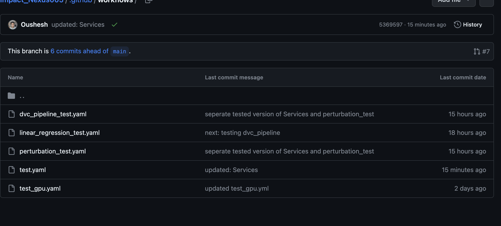
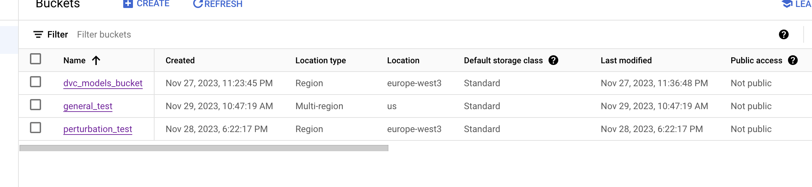

## Getting Started:

    make run  -- spin off the django server.   
    
    (core to all services provided with different to previous codebase with multiple projects)

    
    
   
The project given was more experimental and not ready for production.
Below find the diagram from the overall pipeline implementation, with highlights 
on how parts of the project were proposed to be readapted and how I propose to unify
the entire solution into services.

   The overall pipeline consists of services (django and Ninja API based) both for the data expert team
   (endpoints) used by the Data Engineers, Data Scientists, ML Engineers and MLOPs/DEV OPS people.

   Below find the diagram of the overall pipeline


   
    The pipeline consists of the Services. Services cater for manual processes for different stakeholders within a company:
    1. Django service provides endpoints for:
        
    
        A: Data Optimisation (from .xlsx,csv,.tsv,.pdf, etc... to unified format conversion to parquet) 
           Services/services_app/api/routers/parquet_conversion.py
        
        
        B: Builds knowledgebase (takes data from master knowledge folder to produce a jsonl knowledge base with source folder and subfolders as metadata and 
           This in turn can be later used with neojs for data visualisation. 
           Services/services_app/api/routers/build_knowledgebase.py
        
        C: Incoming Data Check.
           a suite of tests thats test the incoming, gets its embeddings (can be later used to semantically cluster and check for Data or label
           drifts).


It consists of Services with the following directories. In General its a django project.

```
    Services
    │   Airbyte (should be a different repo: airbyte github clone) 
    │   services_app
    │   │   api
    │   │   │   
    │   │   └─── routers
    │   │   └─── build_knowledgebase.py
    │   │   │    └─── data_processor_classification_job.py
    │   │   │    └─── incoming_data_deepcheck.py
    │   │   │    └─── model_downloader.py
    │   │   │    └─── parquet_conversion.py
    │   │   └─── schemas
    │   │        └─── annotationOUT.py
    │   │        └─── DataOUT.py
    │   │        └─── ImpactScreeningOUT.py
    │   │        └─── rest_api_schema.py
    │   services_project
    │   │   
    │   wandb  (service to get the visualisation on the quality of the incoming data)
   ```   
    
   The improvements I proposed are based on 
   * Python Programming style
   * Data Costs and Scalability
   * Data Download, Data Ingestion and Data Aggregration
   * Incoming Data Quality Check, Data Drift 
   * MLOPs, Data Versioning, Continuous Machine Learning (CML), CI/CD ML Suite Test
    
   In each case I reported why and how.

## Python Programming Style 
    1. * blake (DONE)
       * add isort pre-commit configs.
       * pre-commit run
       * for all files in repo: pre-commit run -a
       * This will allow to test for code quality once installed.
       * pre-commit install

    2. Github actions when merging branches. (configure tests)
        
    3. Good critics: (Django or FastAPI is good).
       I would have put a minus if things like Flask or streamlit 
       were to be used.

    4. jupyter notebooks or google colab is good
       use notebooks from google colab its cheap and 
       way fast for a team to work with rather than
       configuring gpu configs locally.

    5.  

## Data Costs and Scalabitliy: 
   Data comes in different formats: pdf,csv,tsv,xslx,json,jsonl, etc..
   I propose to convert them to apache parquet both for faster data transfer and data readability purposes leading
   to massive cost savings as data becomes enormous.
   
   
     In perspective:


   

## Data Download && Data Ingestion && Data Aggregation
   * Enhance Data Collection from different sources: Airbyte (scrape data from api endpoints) -->
     save onto s3 (save the data and write migrations on Django to that).
    
     Example: Airbyte with Oekobaudat (Data Enhancing) --> Anomaly Detection

   * Endpoints Django --> (absorb all data) --> postgresql --> show statistics 
   * Unified Data Format (migration)
   * Data Gets converted to apache Parquet Data Unified Format Conversion (Apache Parquet) --> Statistics
   * Anomaly Detection --> Deep Checks
   * Airtable to ApacheParquet. (endpoints to classify data --> and optimise conversion on apache parquet)
   * Semantic categorisation of data 


## Data Quality Check:
   Done with DeepCheck. Current implementation 

## Data Visualisation Tool
   * Company Stats: (Downloaded: processed, trained)

## Setting up Git Hooks (DONE)
    This repository uses pre-commit to maintain code quality.

To run pre-commit checks on changed files use:

pre-commit run
To run against all files the whole repository:

pre-commit run -a
To run a specific tool against a specific file or directory (the list of available tools can be found in .pre-commit-config.yaml):

pre-commit run <tool name> <file path>
To install pre-commit as a git hook that will run automatically on commit (recommended):

pre-commit install

## Data Optimisation storage (DONE)
   * convert csv and other data types to optimise for storage
     apache parquet.
   * if your data is hugely dependent on csv convert to apache parquet then optimise the data storage in the system. (cost of optimisation)
   
## Efficiency of Data Collection process 
   * implement stream application for data collection (airbyte for extra api development to stream data
     from different sources.)

## Data Retraining and Versioning.
   * add an endpoint for absorbing from different (sources), different 
     automatic trigger process of training if new data are coming.
     anomaly detection: on data (TODO)
     how the pipelines are modules can be connected together (TODAY)

## Deep checks: 
   MLOPS operations and testing (DONE)
   insights generated from data 

## Data Steps:

## Automatic Retraining when new data comes in:
   * data: (will add today as well.)

## Changes made:
   * Logs should be under log folder

## Assessment Service
   * Abstracts the Folder as a Knowledge Base. (DONE)
     #TODO: Folder selection step using Django Ninja Form select

## Logs for Supabase client
   python3 -m pip install supabase

## TODO and Progress Tracking.
   Django Project abstracting Knowledge Base from the Folder info into massive json (DONE)
   Add Deepcheck to check incoming data
   Aggregate Data from scraping (Airbyte example oekobaudat data here)
   
   Bad Comments: why have 2 application running: (unified: into 1 Django structure) rest_api
    Rest_api 
## MLOPS
    * Technical risk -- poorly performing
    * Compliance risk -- violating regulatory or corporate policies 

## Why make it like the idea of services?
   Tomorrow when the company has to change infrastructure you can use stuffs like Terraform or ansible 
   to make the transition for different versions of the app.

## Make Budget for ChatGPT or github copilot
   * This will 5-10x productivity your engineers in the team.
   * This is crucial for GPT 


## ML OPS && CML (Continuous Machine Learning) 
   
   The previous pipeline dit not account for the OPS and Continuous Machine Learning. CML + DVC 
   is one of the best framework to achieve this. It treats data and models like Git files with hash. 
   Even only pipelines that have been changed.

   Using DVC and CML allows multiple people to work in different branches simultaneously on the same part 
   of the pipeline or different parts of the pipeline and push code. The .yaml is written such that only
   changes in the specific folder corresponding to the tests gets triggered saving time and being more efficient.

    
   * Github actions (.github/workflows/<test.yaml>) + Data Version Control 


   1. Data Version Control: "Git for Data"
      dvc get downloads any data from a url pointing to s3, google bucket
      or other cloud services and saves where you want.
      It uses hash map like git to efficiently track and cash changes.

    Services/DVC contains the different workflows
    Example of Data Versioning:
    
    dvc get gs://dvc_models_bucket/models.pkl -o Services/DVC/models/models.pkl
    
    Track: dvc add Services/DVC/models/models.pkl
    Any changes people working with you did either on the bucket or new model
    it gets pushed and tested with the yaml. The test gets trrigered and pipeline is evaluated.
    


    Example: Services/DVC/test 
    A. Train script model was changed from LinearRegression to Lasso Model.
    B. The change triggers the test written under .github/workflows/test.yaml
    C. dvc can also be use to track the model with the bucket in google cloud: gs://dvc_models_bucket/models/


The Github workflows 



corresponds to the buckets on google bucket or any other service.


    
    Every DVC Experiment is:
    ```
    Services/DVC/<Name of Workflow or pipeline> 
    │   model/
    │   data/    
    │   test.py
    │   train.py
    │   other_scripts.py
    │   requirements.txt
    ```

  2.  Data Pipelines: (dubbed as Makefile for ML Projects along with CML(Continuous Machine Learning))
     Usually pipelines are connected with different steps in different.py files.

      Changing anything in the train or any other script will only trigger that script. When your pipeline gets huge
      and uses GPU for training. Only the changes in script will run the results of the users that did not change
      will be retrieved and only the specific script with changes will run.


    3. ML OPS and Robustness:

    Perturbation test is used to test robustness of a given pipeline. The inputs are perturbed
    and the model from hugging face like most of the models used at Impact Nexus are used.
    This was missing in the old pipeline. The pipeline  
   


    
    Other tests are mentionned in the department of Data and Label Drift as well as Embeddings Drift

   
  3. Workflows Requiring GPUs:

   Heavy Training requiring GPUs cannot be run on github directly. Instead spin off GPU service and attach the worker. 
   Or: use local GPU. (PS: I dont have on my mac m2 pro.)
   
   A. 
        
        GPU nvidia-docker cml aws ec2 deep learning AMI
        Choose aws ec2 deep learning AMI Ubuntu 18.04
        ssh into your ec2 instance from that terminal you can work into 
        your pycharm or terminal.

   B.    
        
        run nvidia-smi
        Check all the gpus in the docker
        docker run --gpus all dvcorg/cml-py3 nvidia-smi
       
        This will check if cml image of nvidia-smi is available otherwise
        it will pull it.
        
        You should see your gpu on terminal
   
   C. 
        
        Next step is to connect GH (github-actions) with docker. (I personally
        dont have GPU on my mac M2)

        Reference: https://www.jeremyjordan.me/testing-ml/
    
       docker run --name gpurunner -d --gpus all -e RUNNER_IDLE_TIMEOUT=1000 -e RUNNER_LABELS=cml,gpu -e RUNNER_REPO="url_to_your_github_repository" -e repo_token="your_personal_access_token"
    
       This gpu docker cml can run in the background. This will be a self-hosted runner running on your ec2 instance or gcp.

       The CML docker container will listen to the workflows from github or gitlab.
        
        You can autoscale the workflows on self-hosted gpu machines for lots of developers
        if they exist: https://docs.github.com/en/webhooks/webhook-events-and-payloads#workflow_job


## TODOS:
   * Bugs (add support for multiple pages for .xslx files in: UoA .xslx )
   * Add logging to all endpoints and save the logs directly on supabase.

**## DONE
   * Data Optimisation Cost optimisation csv,json,jsonl, pandas --> apache parquet
   * Data Sync 
   * Embeddings Semantic knowledge of Data (ToDAY: Done)
   * Deep Check to check for anomalies in incoming data (TOday:Done)
   * Tests: pytest fixture and coverage of data (added pytest-coverage to see which part of the code were ran during our code execution)
   * moved rest_api_schema under services of schema.
   * moved assets under folder data
   * moved language model under folder model
   * used embeddings from openai ada --> no need for python-levenstein distance (why?)
     * semantic difference is better with lemma, stemming 
   * NLP consists of different jobs: 
     * Language Modelling: (Gloves, Wordnet, ADA Embeddings, co-occurrence) (TODO: replace with openai ada)
     * Classification: emotional analysis, named entity recognition 
     * embeddings for 
   * Endpoint to get DeepCheck data. (TODAY)
   * CI/CD (TODO) 
   * logging in supabase all endpoints + Snowflake + gsutil (todo)
   * GPU mlops actions: cml (continuous machine learning, github actions, nividia-docker)
   * build spec.yml into Makefile (DONE)
   * Getting away completely from Spacy. (DONE)**


## Resources: 
    https://eugeneyan.com/writing/setting-up-python-project-for-automation-and-collaboration/
    https://stackoverflow.com/questions/67646383/authentication-to-github-using-personal-access-token-on-macos#:~:text=3%20Answers&text=Run%20a%20git%20push%20or,it%20and%20paste%20it%20in).
    https://iterative.ai/blog/cml-self-hosted-runners-on-demand-with-gpus
    (how to self-host runners on gpus)
    

## Structure of the Project:
   


        
## Tests for high Standards from here: 
   * https://eugeneyan.com/writing/setting-up-python-project-for-automation-and-collaboration/


## Changes Made: 
   1. 


## Further Improvements:
   The DVC pipeline from Data Version Control already contains


