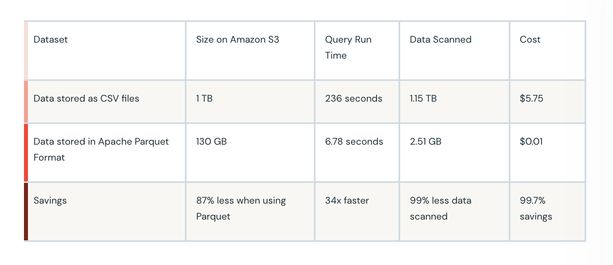

## My improvements is based on:
   1. Python Programming Style
   2. Airbyte for Data Collection
   3. Automatic training when new data comes in: Apache Airflow 
   4. Anomaly Detection (new module)
   5. slack notification or so once model gets trained.
   6. ETL snowflake for Data Management
   7. Data Storage Management (space for bulk data)
      --> Data Converter to Apache Parquet
   8. Scale issues. 

## Python Programming Style 
    1. * blake (DONE)
       * add isort pre-commit configs.
       * pre-commit run
       * for all files in repo: pre-commit run -a
       * This will allow to test for code quality once installed.
       * pre-commit install

    2. Github actions when merging branches. (configure tests)
        
    3. Good critics: (Django or FastAPI is good).
       I would have put a minus if things like Flask or streamlit 
       were to be used.

    4. jupyter notebooks or google colab is good
       use notebooks from google colab its cheap and 
       way fast for a team to work with rather than
       configuring gpu configs locally.

    5.  

## Scalabilty of Data: 
   CSV is a simple and common format that is used 
   by many tools such as Excel, Google Sheets and others.
   
   Disadvantages:
   * Amazon Athena and Spectrum --> pricing based on 
     amount of data scanned per query.
   * Google GS/Amazon S3 will charge according to the amount 
     of data available.
     
     In perspective:

## Data Download (DONE) , Data Ingestion, Data Aggregation
   * Enhance Data Collection from different sources: Airbyte (scrape data from api endpoints) -->
     save onto s3 (save the data and write migrations on Django to that).
    
     Example: Airbyte with Oekobaudat (Data Enhancing) --> Anomaly Detection

   * Endpoints Django --> (absorb all data) --> postgresql --> show statistics 
   * Unified Data Format (migration)
   * Data Gets converted to apache Parquet Data Unified Format Conversion (Apache Parquet) --> Statistics
   * Anomaly Detection --> Deep Checks
   * Airtable to ApacheParquet. (endpoints to classify data --> and optimise conversion on apache parquet)
   * Semantic categorisation of data 

## Example of Model Retraining
   * Dagster, Apache Airflow 
   * Direct Acyclic Graphs
   * Data incoming model retraining

## Data Quality Check:
   * Tool (Data Drift)
   * service 
## Data Visualisation Tool
   * Company Stats: (Downloaded: processed, trained)

## Setting up Git Hooks (DONE)
    This repository uses pre-commit to maintain code quality.

To run pre-commit checks on changed files use:

pre-commit run
To run against all files the whole repository:

pre-commit run -a
To run a specific tool against a specific file or directory (the list of available tools can be found in .pre-commit-config.yaml):

pre-commit run <tool name> <file path>
To install pre-commit as a git hook that will run automatically on commit (recommended):

pre-commit install

## Data Optimisation storage (DONE)
   * convert csv and other data types to optimise for storage
     apache parquet.
   * if your data is hugely dependent on csv convert to apache parquet then optimise the data storage in the system. (cost of optimisation)
   
## Efficiency of Data Collection process 
   * implement stream application for data collection (airbyte for extra api development to stream data
     from different sources.)

## Data Retraining and Versioning.
   * add an endpoint for absorbing from different (sources), different 
     automatic trigger process of training if new data are coming.
     anomaly detection: on data (TODO)
     how the pipelines are modules can be connected together (TODAY)

## Deep checks: 
   MLOPS operations and testing (DONE)
   insights generated from data 

## Data Steps:

## Automatic Retraining when new data comes in:
   * data: (will add today as well.)

## Changes made:
   * Logs should be under log folder

## Assessment Service
   * Abstracts the Folder as a Knowledge Base. (DONE)
     #TODO: Folder selection step using Django Ninja Form select

## Logs for Supabase client
   python3 -m pip install supabase

## TODO and Progress Tracking.
   Django Project abstracting Knowledge Base from the Folder info into massive json (DONE)
   Add Deepcheck to check incoming data
   Aggregate Data from scraping (Airbyte example oekobaudat data here)
   
   Bad Comments: why have 2 application running: (unified: into 1 Django structure) rest_api
    Rest_api 
## MLOPS
    * Technical risk -- poorly performing
    * Compliance risk -- violating regulatory or corporate policies 

## Why make it like the idea of services?
   Tomorrow when the company has to change infrastructure you can use stuffs like Terraform or ansible 
   to make the transition for different versions of the app.

## Make Budget for ChatGPT or github copilot
   * This will 5-10x productivity your engineers in the team.
   * This is crucial for GPT 

## TODOS:
   * Bugs (add support for multiple pages for .xslx files in: UoA .xslx )

## DONE
   * Data Optimisation Cost optimisation csv,json,jsonl, pandas --> apache parquet
   * Data Sync
   * Embeddings Semantic knowledge of Data
   * Deep Check to check for anomalies in incoming data

## Tests for high Standards from here: 
   * https://eugeneyan.com/writing/setting-up-python-project-for-automation-and-collaboration/

## Write Tests for ML Here: 

